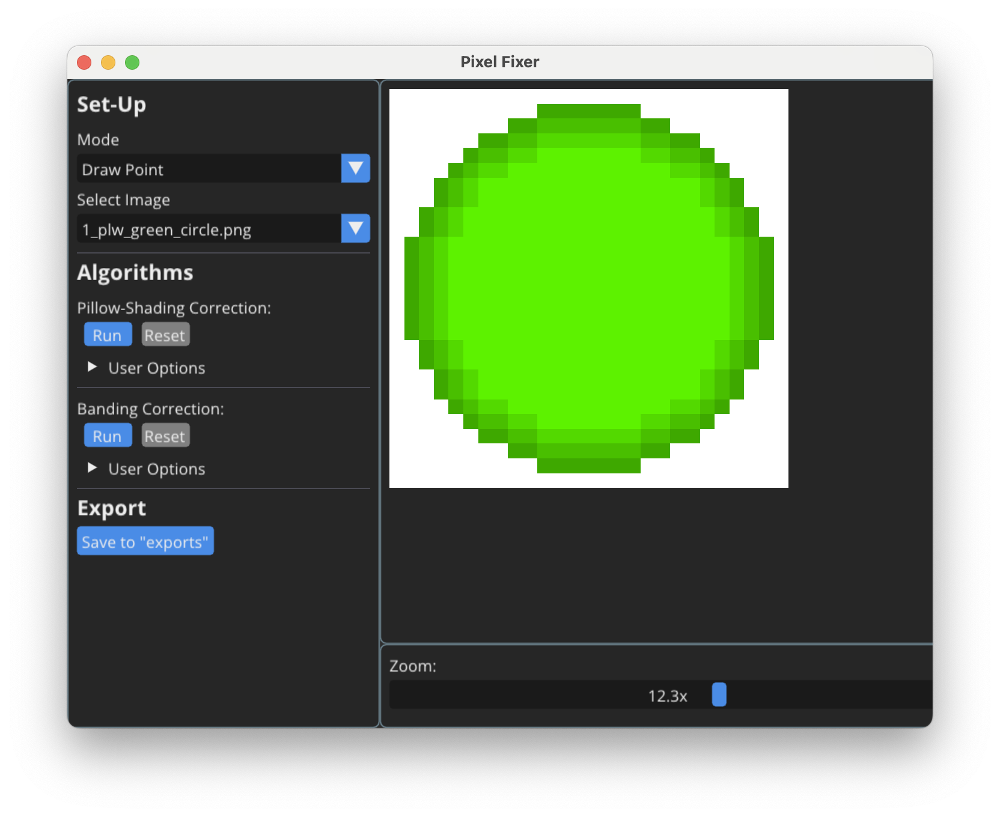

# CSE3000 Research Project: Improving Pixel Art through Semi-Automated Correction of Spatial Faults

## Project Info
This project represents the codebase of Rares Bites' bachelor-end project (CSE3000). The main goal of the project was to correct common spatial faults in Pixel Art (i.e., mistakes relating to the pixel placement rather than the used color palettes), such as banding or pillow-shading.

### Libraries Used
- [Dear ImGui](https://github.com/ocornut/imgui) – GUI
- [GLFW](https://github.com/glfw/glfw) – Windowing
- OpenGL – Graphics
- OpenCV – Image processing
- glm – Mathematics
- [stb](https://github.com/nothings/stb) – Single-header libraries for image/file handling

---

## Author
- **Name**: Rares Bites
- **Email**: bitesrares "at" gmail "dot" com
- **University**: Delft University of Technology
- **Course**: CSE3000 Research Project

---

## How to Run

### Prerequisites
- **C++20** compatible compiler
- **CMake 3.31+**
- Installed: OpenGL, OpenCV, glm

> **Note**: This codebase is configured for ARM64 architecture. If you're using x86/x64 or another platform, you may need to adjust library dependencies or `CMakeLists.txt`.

### Steps
1. Open the project in a CMake-compatible IDE.
2. Optional: Configure CMake.
3. Build the project.
4. Run the application.

## Usage
Once the application is open, there are two modes possible: either draw your own Pixel Art, or display an existing image from `assets/images` (where you can also manually add your own images). You can choose which algorithm you wish to run on the displayed Pixel Art, and observe the corrections made.

Testing can be done in the form of visual debugging, in-app.

